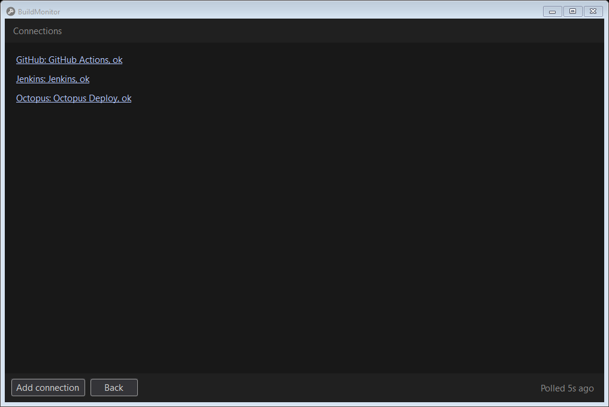

<!--
GENERATED FILE - DO NOT EDIT
This file was generated by [MarkdownSnippets](https://github.com/SimonCropp/MarkdownSnippets).
Source File: /docs/mdsource/connections.source.md
To change this file edit the source file and then run MarkdownSnippets.
-->

# Connections

The CI services being watched. Connections, at the bottom of the window or in the tray menu, opens the list.

Windows:

Each connection shows its service and how its last poll went. Click one to edit it, or Add connection for a new one. See [Authentication](auth.md) for what each provider needs.

Each editor saves its own connection, so the list has Back rather than Save and Cancel, and closing an editor opened from it comes back to it. Until there is a connection, Add connection is also at the bottom of the window itself.

Test checks the credential without saving. Sign in starts a browser or device sign in where the provider supports one. Save stores the credential in the platform's secret store and starts polling; nothing secret is written to settings.json.

Where the provider reports what a credential may do, Test says so, and a connection whose credential can only watch shows as watch only in the list. Its rows offer no Retry, Cancel or Run next. Each provider's page says what it checks.

Remove, on a connection already saved, first opens a page naming it and saying what removing it deletes. Only that page's Remove deletes anything.
