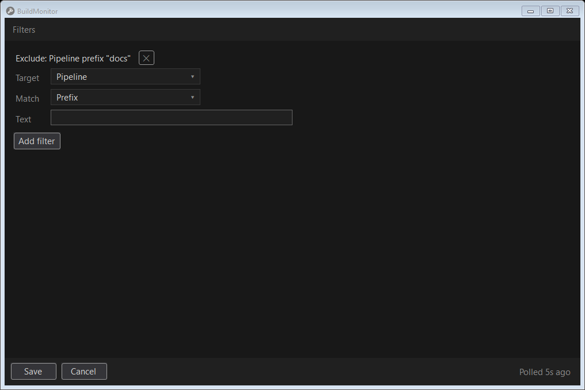
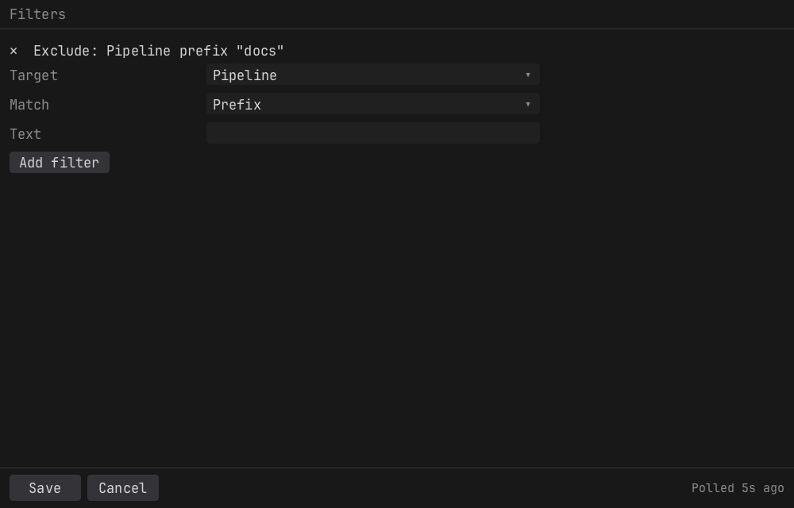
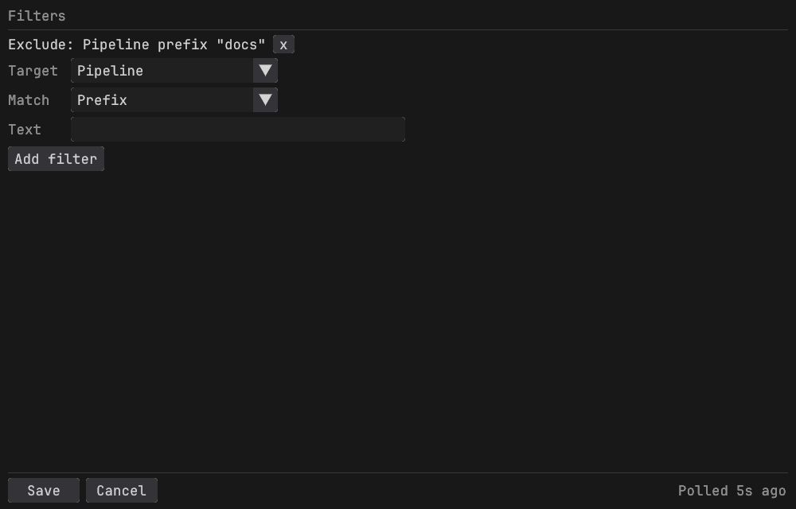

<!--
GENERATED FILE - DO NOT EDIT
This file was generated by [MarkdownSnippets](https://github.com/SimonCropp/MarkdownSnippets).
Source File: /docs/mdsource/filters.source.md
To change this file edit the source file and then run MarkdownSnippets.
-->

# Filters

Windows:

macOS:

Linux:

A filter excludes what it matches. Each one has:

 * a target: the pipeline name, the repository name, the org the repository sits under, or the branch name
 * a match: exact, prefix, suffix or contains
 * the text, compared without regard to case

The org of a repository is the part of its name before the slash: the owner of `SimonCropp/Verify`, the workspace of a Bitbucket repository, the top level group of a GitLab project. A service with nothing above the repository, such as Azure DevOps or TeamCity, has no org.

Pipeline, repository and org filters are applied before a pipeline is fetched, so an excluded pipeline costs no API calls. Where discovery itself pays a request per repository, as GitHub Actions and Azure DevOps do, an org or repository filter is applied before that request too, so ignoring a busy org makes every poll cheaper rather than only shorter. Branch filters apply to the builds that come back.

The context menu on a row adds an exact filter for it at once. Each item names what it excludes, in the word the service uses: "Exclude action: CI", "Exclude branch: main", "Exclude repo: SimonCropp/Verify", "Exclude org: SimonCropp". The branch item is left out for a service with no branches, the repo item for a service whose pipeline is the repository, and the org item for a service with no level above the repository. A group's row offers each item that every build in the group shares: a group of one repository's workflows offers their branch, the repository and its org but no one workflow, and a group made by a prefix across several repositories offers no repository.

To narrow the list for a moment rather than exclude anything, type in the Filter box at the top of the window instead. See [The window](tray.md#the-window).

Filters are saved in settings.json and apply to every connection.
