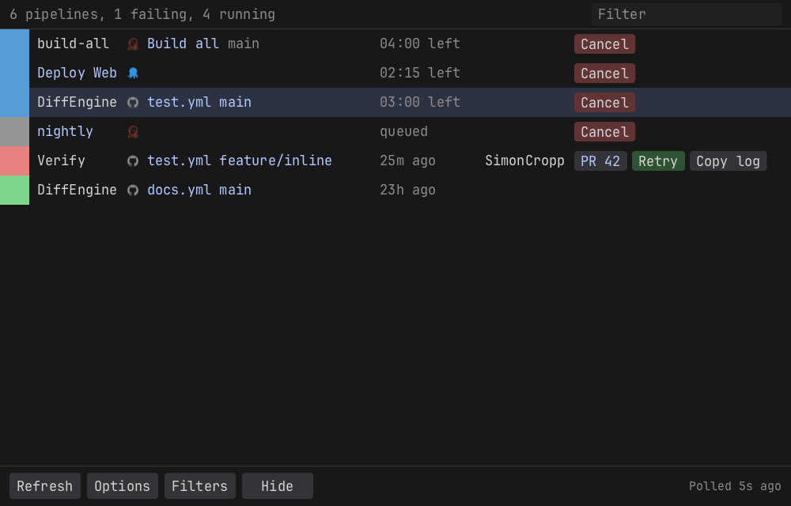

<!--
GENERATED FILE - DO NOT EDIT
This file was generated by [MarkdownSnippets](https://github.com/SimonCropp/MarkdownSnippets).
Source File: /docs/mdsource/macos.source.md
To change this file edit the source file and then run MarkdownSnippets.
-->

# macOS

The macOS head is AppKit: a menu bar item and a window, drawn by a Swift library the tool carries for both Intel and Apple silicon. There is no app bundle; the tool is a plain executable, like every dotnet tool. The Dock icon may flash briefly at start, which is the price of that, and failure notifications go through `osascript` because Notification Center only takes them from a bundle.

## Credentials

Tokens are stored in the login Keychain as generic passwords under the service name BuildMonitor, through the `security` command. macOS may ask once to allow access after an update, because the executable that asks has moved.

## Run at startup

A launch agent, `~/Library/LaunchAgents/com.simoncropp.buildmonitor.plist`, loaded with `launchctl bootstrap`. It starts the tray once at login and does not restart it after Exit.
