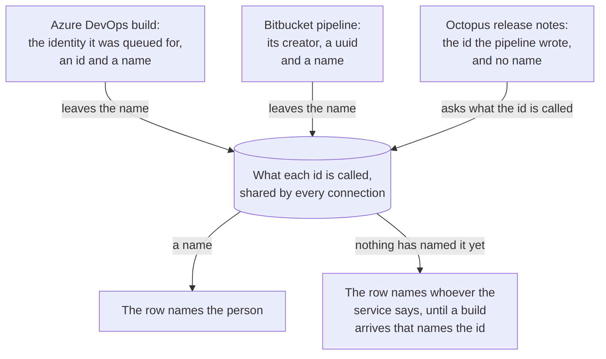

# Authors

The name on a row is whoever the run was for. Only a failed row shows one: on a passing or a running build the name says nothing about what to do. It is the person's first name, or their whole name where two of the people named share one.

Where that name comes from is the provider's own:

| Provider | Names |
|---|---|
| AppVeyor | The commit's author |
| Azure DevOps | Whoever the build was queued for |
| Bitbucket Pipelines | Whoever started the pipeline |
| GitHub Actions | The run's actor |
| GitLab CI | Whoever started the pipeline |
| GoCD | The author of the change that set it off |
| Jenkins | No one, unless a build parameter says |
| Octopus Deploy | Whoever the release was created for |
| TeamCity | Whoever triggered the build |
| Travis CI | The commit's author |

## Overriding it

A run queued on someone else's behalf names the account that queued it, which is nobody to talk to about a failure: an end to end suite a service account runs for whoever committed the code names the service account. Where the service has somewhere for a pipeline to write, the pipeline can say who the run is really for, under the name `TriggeredBy`:

 * Azure DevOps: a [build property](providers/azure-devops.md#authors).
 * TeamCity: a [build parameter](providers/teamcity.md#authors).
 * Jenkins: a [build parameter](providers/jenkins.md#authors).

Its value is the person's name, or the id of one, which is named as below. Octopus is the exception: a deployment has nowhere for such a value, and a release's [notes](providers/octopus.md#authors) carry the id under their own name.

None of this is something a service writes on its own, so no run carries one by accident, and one that does not is named as it was before.

The rest have nowhere to put it: GitHub Actions, Bitbucket Pipelines, GitLab CI, AppVeyor, Travis CI and GoCD send nothing with a run that a pipeline can write and this can read.

## Ids shared between connections

An id is not a name, and the service handed one often cannot resolve it: the id in an Octopus release was minted by Azure DevOps, and Octopus has never heard of it. Rather than pay for a lookup, which also needs rights the token may not carry, every provider leaves behind the names it is given for free. A build already names the identity it was queued for, id and all.

So the names are kept where every connection's provider can read them, and an id from one service is named by another. Ids are matched as guids, which are unique wherever they were minted; a user id that is not one, such as an Octopus `Users-123`, names nobody and is left alone.

Nothing of this is kept on disk: a fresh run of the tray learns the names again from the first builds it fetches, so a row can name the service for a poll or two, and goes on doing so for anyone who has started nothing themselves. Which id a row settled on, and which it could not name, is in the log at Debug level (see [Troubleshooting](troubleshooting.md)).
