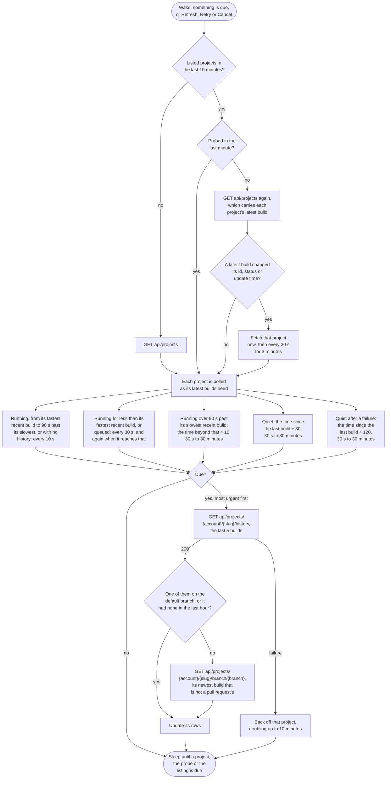

# AppVeyor

Watches every project the token can see.

## Credential

An [API token](https://ci.appveyor.com/api-keys). A v2 token, which spans every account the user belongs to, also needs the account name in the connection.

## Rows

One per project. The logo opens the project on AppVeyor and the name opens the repository behind it. AppVeyor reports the repository as a type and an `owner/name` pair rather than an address, so only GitHub projects get a name that links, and their branches and pull requests link there too.

AppVeyor reports a pull request build's branch as the one it targets, so it is shown on the branch it came from instead, from the build's `pullRequestHeadBranch`, as `owner:branch` when that is in a fork, and its branch opens in the fork.

The project's default branch is the one its pull request builds target, or its other builds are on, before AppVeyor's own setting for it: that setting is the repository's default branch when the project was added, and a repository that has since moved from master to main is still master there.

AppVeyor keeps a build after its branch is deleted, and says nothing of it. A failed branch of a project on GitHub is asked of a [GitHub connection](github.md#rows), where there is one, whether its pull request was merged or closed or the branch deleted, and loses its row if so. Any other failed branch loses it once the default branch has built since it failed.

## Actions

 * Retry re-runs the build
 * Cancel cancels a queued or running build
 * Log copies the logs of the failed jobs

## Estimates

The countdown comes from the median of the project's last ten successful builds.

## Polling

Each project is fetched on its own schedule (see [Poll intervals](../options.md#poll-intervals)). AppVeyor sends no ETags, so every request returns a full response. Once a minute the projects list is read, which carries each project's latest build, and a project whose latest build changed is fetched at once rather than when its schedule comes round. A build that starts on another branch while a newer one exists waits for the schedule, which on a quiet project is up to thirty minutes.

The history is the last five builds of any kind, and a burst of pull requests fills it: each builds its branch and then the pull request. When none of the five is on the default branch, its newest build is asked for on its own. A default branch with nothing built on it since the [history cutoff](../options.md#show-builds-from-the-last-days) is not asked about again for an hour.

## API notes

Researched 2026-09-14. [live] means checked with anonymous requests against ci.appveyor.com; [docs] names the evidence. See [Provider APIs](api-comparison.md) for every provider side by side.

### Rate limits

None published, and no rate limit headers on project, history or 401 responses [live].

### Conditional requests

None. Responses send `Cache-Control: no-cache`, `Pragma: no-cache` and `Expires: -1`, with no ETag or Last-Modified [live]. A five build history is about 7.6 KB.

### Change detection

`GET /api/projects`, which needs a token, includes each project's latest build in `builds`: `buildId`, `version`, `status`, `started`, `finished`, `created`, `updated`, `branch`, `commitId` and `authorName` [docs]. The single project endpoint returns its build separately, as `build` [live].

### Batching

Only the latest build per project, through the projects list. History is per project.

### Branches and pull requests

A pull request build's `branch` is the branch it targets; `pullRequestHeadBranch`, `pullRequestHeadRepository` and `pullRequestHeadCommitId` say where it came from, and `commitId` is the merge commit that was built [live]. The project's `repositoryBranch` is the repository's default branch when the project was added and is not updated when the repository renames it: Verify.EntityFramework's says master while the repository's is main [live]. `history?branch={branch}` still includes the pull request builds that target that branch [live]. `GET api/projects/{account}/{slug}/branch/{branch}` answers with the newest build on the branch that is not a pull request's, with the branch escaped or not, or a JSON 404 `Build not found or access denied.` where there is none [live].

### Accounts

A v2 token spans accounts, so calls are prefixed with `api/account/{account}` [docs]. Only the calls that do not already name the account have a prefixed route. The projects list and re-run do; history and cancel, whose paths carry the account, do not, and `GET api/account/{account}/projects/{account}/{slug}/history` answers 200 with the web app's HTML where an unknown path under `api/` gets a JSON 404 [live]. So history and cancel go unprefixed.

### Sources

 * [Projects and builds API](https://www.appveyor.com/docs/api/projects-builds/)
 * [API](https://www.appveyor.com/docs/api/)
