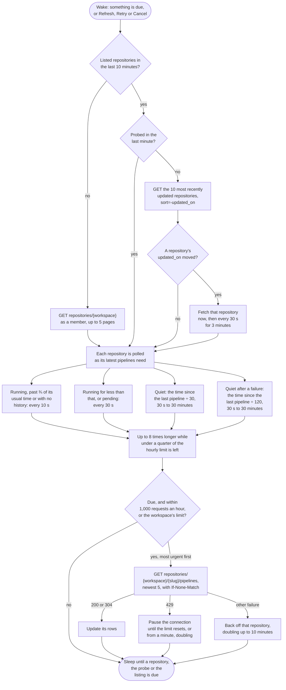

# Bitbucket Pipelines

Watches every repository the user is a member of in one workspace.

## Credential

An Atlassian [API token](https://id.atlassian.com/manage-profile/security/api-tokens) with the scopes `read:pipeline:bitbucket`, `write:pipeline:bitbucket`, `read:repository:bitbucket` and `read:workspace:bitbucket`, together with the Atlassian account email. App passwords stopped working in June 2026.

## Rows

One per repository. Pull request pipelines link to the pull request.

## Actions

 * Retry starts a new pipeline for the same commit; Bitbucket has no rerun
 * Cancel stops a pending or running pipeline

## Estimates

The countdown comes from the median of the repository's last ten successful pipelines.

## Polling

Bitbucket allows a thousand requests an hour, or the larger limit a workspace reports, and charges one per repository. Requests are budgeted to fit that hour: running and recently built repositories go first, and a quiet repository waits up to thirty minutes.

Once a minute the ten most recently updated repositories are read, which a push moves to the top within seconds, so a pushed repository is fetched at once rather than when its schedule comes round. Pipelines started without a push, such as scheduled and manual runs, wait for the schedule.

## API notes

Researched 2026-09-14. [live] means checked with anonymous requests against api.bitbucket.org; [docs] names the evidence. See [Provider APIs](api-comparison.md) for every provider side by side.

### Rate limits

 * 1,000 requests an hour per user, over a rolling hour, for `/2.0/repositories/*` including pipelines [docs].
 * Scaled limits, 1,000 plus 10 per seat above 100 up to 10,000, apply only to workspace, project and repository access tokens on Standard and Premium plans with more than 100 seats. An Atlassian account API token stays at 1,000 [docs].
 * Anonymous requests get 60 an hour per IP address [docs].
 * `X-RateLimit-Limit` lists windows, `60, 60;w=3600`, so read the first number. `X-RateLimit-Reset` is the seconds remaining in the window, not a Unix time: it read 960 at 01:44 UTC [live]. `X-RateLimit-NearLimit` is true below 20% remaining [docs].
 * Past the limit the answer is 429. Whether it carries `Retry-After` is undocumented.

### Conditional requests

 * Repository and pipeline lists send strong ETags and answer `If-None-Match` with 304 [live]. Whether a 304 counts against the limit is undocumented.
 * Anonymous repository lists are cached by CloudFront for 900 seconds, varying on `Authorization` [live].

### Change detection

 * `repositories/{workspace}?role=member&sort=-updated_on&fields=values.slug,values.updated_on` puts the most recently updated repositories first.
 * A push moved `updated_on` within two seconds, and its pipeline appeared 14 seconds after that [live, one sample]. Updating a pull request did not move it, and it sometimes moves with no new commit.

### Batching

None. Pipelines exist only per repository, and no workspace endpoint lists pipelines, commits or activity [docs].

### Quirks

 * The default order of the pipelines list is undocumented; `sort=-created_on` returns the newest first. The other sort keys are `creator.uuid` and `run_creation_date`.
 * `pagelen` is at most 100. Filters include `status`, `trigger_type` (PUSH, MANUAL, SCHEDULED, PARENT_STEP) and `target.*` [docs].

### Sources

 * [API request limits](https://support.atlassian.com/bitbucket-cloud/docs/api-request-limits/)
 * [Rate limit troubleshooting](https://support.atlassian.com/bitbucket-cloud/kb/bitbucket-cloud-rate-limit-troubleshooting/)
 * [Scaled rate limits](https://www.atlassian.com/bitbucket/blog/introducing-scaled-rate-limits-for-bitbucket-cloud-api)
 * [OpenAPI specification](https://dac-static.atlassian.com/cloud/bitbucket/swagger.v3.json)
 * [Pipelines API](https://developer.atlassian.com/cloud/bitbucket/rest/api-group-pipelines/)
