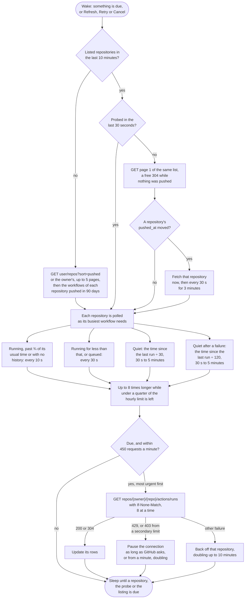

# GitHub Actions

Watches the workflows of every repository the token can see, or of one organization or user when the connection names one. Repositories with no push in ninety days, archived ones and disabled ones are skipped.

## Credential

A fine grained [personal access token](https://github.com/settings/personal-access-tokens/new) with Actions read and write and Metadata read on the repositories to watch, or a classic token with the `repo` scope. Or sign in: the device flow, or the browser flow once an OAuth App is registered. See [Authentication](../auth.md).

For GitHub Enterprise Server enter the server URL; the API is reached under `/api/v3`.

## Rows

One per workflow, showing the latest run. A run on another branch that is queued or running gets its own row. Pull request runs link to the pull request.

## Actions

 * Retry re-runs only the failed jobs of a failed run, and the whole run otherwise
 * Cancel cancels a queued or running run
 * Copy log copies the logs of the jobs that failed or timed out in the latest attempt

## Estimates

GitHub gives none. The countdown comes from the median of the workflow's last ten successful runs.

## Polling

Runs are fetched a repository at a time, each on its own schedule (see [Poll intervals](../options.md#poll-intervals)), with a conditional request: GitHub answers an unchanged repository with a 304 that does not count against the five thousand requests an hour. GitHub also limits requests a minute and counts those 304s, so no more than 450 requests a minute are sent, the most urgent repositories first. The hourly limit is shared with every other tool signed in as the same account.

Each poll interval, page 1 of the repository list is read again, most recently pushed first, with the same conditional request discovery uses, so it costs nothing while nothing is pushed. A repository whose last push moved is fetched at once rather than when its schedule comes round. Runs that start without a push, such as scheduled runs, manual dispatches, re-runs started on the web and pull requests from forks, wait for the schedule: up to five minutes on a quiet repository.

## API notes

Researched 2026-09-14. [live] means checked with requests against api.github.com; [docs] names the evidence. See [Provider APIs](api-comparison.md) for every provider side by side.

### Rate limits

 * REST allows 5,000 requests an hour per user, shared by every OAuth app and personal access token of that user; 15,000 for apps owned by an Enterprise Cloud organization; 60 unauthenticated [docs].
 * Headers: `x-ratelimit-limit`, `x-ratelimit-remaining`, `x-ratelimit-used`, `x-ratelimit-reset` (Unix seconds) and `x-ratelimit-resource` [docs, live].
 * Secondary limits: 100 concurrent requests, 900 points a minute for REST where a GET costs 1, 90 seconds of CPU per 60 seconds, and 80 content creating requests a minute [docs].
 * Either limit answers 403 or 429. Honour `retry-after`; if remaining is 0, wait until the reset; otherwise wait at least a minute and back off exponentially. Continuing while limited risks the integration being banned [docs].
 * GraphQL has its own 5,000 points an hour, and a secondary limit of 2,000 points a minute [docs].

### Conditional requests

 * Lists carry weak ETags. A request with `If-None-Match` answered 304 and left `x-ratelimit-remaining` unchanged, on both `actions/runs` and `orgs/{org}/repos` [docs, live]. It is only free when the request carries the `Authorization` header.
 * The docs do not exempt a 304 from the secondary limits.
 * ETags are per page: a 304 for page 1 says nothing about page 2.
 * Lists send `Cache-Control: private, max-age=60`, and event feeds send `X-Poll-Interval: 60` [live].

### Change detection

 * `user/repos`, `orgs/{org}/repos` and `users/{user}/repos` accept `sort=pushed` and return `pushed_at`, so page 1 holds the most recently pushed repositories and answers 304 while nothing changed [docs, live].
 * `users/{user}/repos` lists public repositories only.
 * `pushed_at` does not move for scheduled runs, manually dispatched runs, re-runs, or pull requests from forks.

### Batching

 * GraphQL can batch: one query returned the head commit and check suites of 75 repositories for 1 point, and `nodes(ids:)` over workflow `node_id`s returns `runs(first: N)` for up to 100 workflows for 1 point [live].
 * `WorkflowRun` has no status, conclusion, branch or start time of its own. They come from its `checkSuite` (status, conclusion, branch, matchingPullRequests) and that suite's `checkRuns` (startedAt, completedAt) [live].
 * GraphQL has no conditional requests.
 * `actions/runs` filters on actor, branch, event, status, created, `exclude_pull_requests`, `check_suite_id` and `head_sha`, and returns at most 1,000 results when filtered [docs].

### Alternatives considered

 * The Events API. `users/{user}/events/orgs/{org}` includes private events, but events arrive 30 seconds to 6 hours late, only 300 events or 30 days are kept, there are no workflow run, check or status events, and a PushEvent carries only `repository_id`, `push_id`, `ref`, `head` and `before` [docs].
 * Search commits. It has its own limit of 30 requests a minute, covers the default branch only, has undocumented index lag, and commits are not runs [docs].

### Sources

 * [Rate limits for the REST API](https://docs.github.com/en/rest/using-the-rest-api/rate-limits-for-the-rest-api)
 * [Best practices for using the REST API](https://docs.github.com/en/rest/using-the-rest-api/best-practices-for-using-the-rest-api)
 * [Events](https://docs.github.com/en/rest/activity/events) and [event types](https://docs.github.com/en/rest/using-the-rest-api/github-event-types)
 * [Search](https://docs.github.com/en/rest/search/search)
 * [GraphQL rate and query limits](https://docs.github.com/en/graphql/overview/rate-limits-and-query-limits-for-the-graphql-api)
 * [Workflow runs](https://docs.github.com/en/rest/actions/workflow-runs)
 * [Repositories](https://docs.github.com/en/rest/repos/repos)
