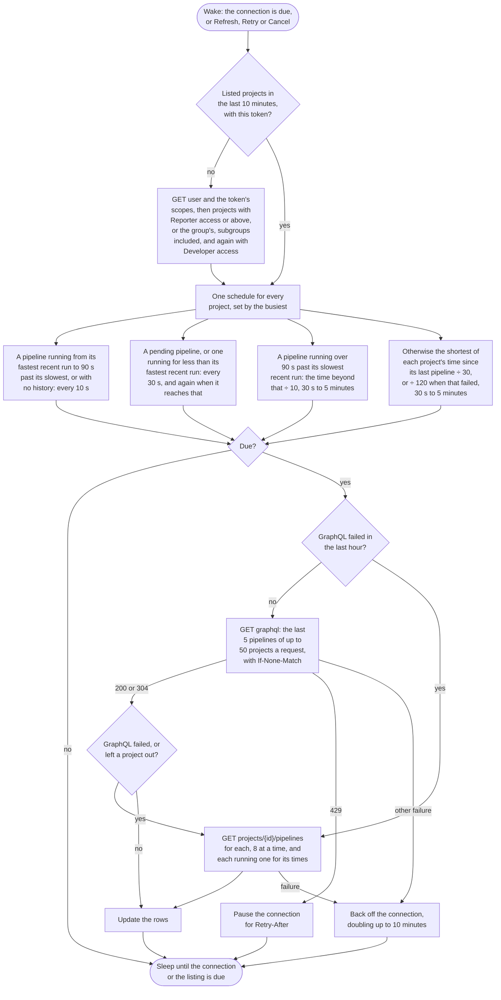

# GitLab CI

Watches every project the user is a member of, or the projects of one group and its subgroups.


## Credential

A [personal access token](https://gitlab.com/-/user_settings/personal_access_tokens) with `api`, or `read_api` to only watch, sent in the `PRIVATE-TOKEN` header; a project or group access token works the same way. Or sign in with PKCE or the device flow, once an application is registered; a self hosted GitLab needs its own application, whose id goes in the connection. A sign in's token is sent as `Authorization: Bearer`, the only header GitLab finds an OAuth token in. See [Authentication](../auth.md).


## Rows

One per project. Merge request pipelines show the merge request number and link to it.


## Actions

 * Retry retries the failed jobs of the pipeline
 * Cancel cancels a pending or running pipeline
 * Log copies the traces of the failed jobs, leaving out jobs allowed to fail

A token with `read_api` and not `api`, pasted or from a sign in, offers neither Retry nor Cancel, and the connection shows as watch only in [Options](../options.md#connections). Nor does a project where the user is only a Reporter, unless the user is an administrator.


## Estimates

The countdown comes from the median of the project's last ten successful pipelines.


## Polling

The pipelines of fifty projects at a time come from one GraphQL request, instead of a request per project and another per running pipeline, so the whole connection is fetched on one schedule (see [Poll intervals](../options.md#poll-intervals)). A project GraphQL leaves out of its answer is fetched over REST, eight projects at a time. A server whose GraphQL fails is fetched over REST for an hour before GraphQL is asked again. GitLab.com allows 2,000 authenticated requests a minute, and counts a 304 as one.




## API notes

Researched 2026-09-14. [live] means checked with anonymous requests against gitlab.com; [docs] and [source] name the evidence. See [Provider APIs](api-comparison.md) for every provider side by side.


### Rate limits

 * GitLab.com allows authenticated API requests 2,000 a minute per user, unauthenticated ones 500 a minute per IP address, and all traffic 2,000 a minute per IP address. Some endpoints are tighter: `GET /projects` 2,000 per ten minutes, `GET /groups/:id/projects` 600 a minute, and `GET /projects/:id` 400 a minute [docs].
 * Self managed servers have these limits off by default [docs].
 * Every response carries `RateLimit-Limit`, `RateLimit-Name`, `RateLimit-Observed`, `RateLimit-Remaining` and `RateLimit-Reset`, a Unix time [live]. A 429 adds `RateLimit-ResetTime`, an HTTP date, and `Retry-After` [docs]. The limits on the Projects, Groups and Users APIs send no informational headers [docs].


### Conditional requests

The pipelines list, a single pipeline, events and GraphQL over GET send weak ETags that digest the body, and answer `If-None-Match` with 304. A 304 still counts against the limit: `RateLimit-Remaining` fell from 499 to 498 [live].


### Change detection

 * `GET /events?scope=all&action=pushed` lists pushes across every project the user can see, with `read_api`, `read_user` or `api` [docs, source]. It misses scheduled, triggered and manual pipelines, and merge trains.
 * A project's `last_activity_at` updates at most once an hour, and pipelines do not touch it [source].
 * A project's `updated_at` moves with a push at most every five minutes, and with any change to the project [source].
 * `GET /pipelines`, from GitLab 19.3, returns only pipelines the user started [docs].


### Batching

GraphQL over GET returns the latest pipelines of many projects in one request, and sends ETags and 304 [live]. For example:

```
api/graphql?query={projects(ids:[…],first:50){nodes{id pipelines(first:5){nodes{id iid status ref sha name createdAt startedAt finishedAt user{name}}}}}}
```

A page holds at most 100 nodes, a query at most 10,000 characters, and a request times out after 30 seconds [docs]. 100 projects with 5 pipelines each is a complexity of about 40 against a limit of 250 [source]. A 200 can still carry `errors`.


### Quirks

 * The pipelines list has no `started_at`, `finished_at`, `duration` or `user`; only a single pipeline does [live, docs].
 * `membership=true` includes projects where the user is only a Guest. Their pipelines need `read_pipeline` and answer 403; `min_access_level=20`, Reporter, leaves them out [docs, source].


### Permissions

Checked 2026-09-16.

 * `GET personal_access_tokens/self` describes the token a request was made with, `scopes` included, and refuses any token that is not a personal, project or group access token [docs, source]. A granular token, `granular: true`, holds its rights outside its scopes [source].
 * An OAuth token is found only in `Authorization: Bearer` or the `access_token` parameter. A token in `PRIVATE-TOKEN` is looked up only as an access token, so an OAuth token there is refused [docs, source].
 * `GET oauth/token/info` reports an OAuth token's scopes as the array `scope`. It sits beside `api/v4`, under the same relative URL root [docs, source].
 * Retrying and cancelling need the `api` scope and the Developer role or above; a Reporter can do neither. A project can restrict cancelling further, and a protected branch needs the right to merge to it [docs].
 * `min_access_level=30` lists the projects where the user holds Developer or above through a membership, so an administrator's other projects are left out [source]. `GET user` sends `is_admin` only to an administrator [source].


### Sources

 * [GitLab.com rate limits](https://docs.gitlab.com/user/gitlab_com/)
 * [User and IP rate limits](https://docs.gitlab.com/administration/settings/user_and_ip_rate_limits/)
 * [Pipelines API](https://docs.gitlab.com/api/pipelines/), [Projects API](https://docs.gitlab.com/api/projects/), [Events API](https://docs.gitlab.com/api/events/) and [GraphQL API](https://docs.gitlab.com/api/graphql/)
 * [Permissions](https://docs.gitlab.com/user/permissions/)
 * [Personal access tokens API](https://docs.gitlab.com/api/personal_access_tokens/) and [OAuth 2.0 identity provider API](https://docs.gitlab.com/api/oauth2/)
 * Source: [event.rb](https://github.com/gitlabhq/gitlabhq/blob/master/app/models/event.rb), [events_finder.rb](https://github.com/gitlabhq/gitlabhq/blob/master/app/finders/events_finder.rb), [pipeline_type.rb](https://github.com/gitlabhq/gitlabhq/blob/master/app/graphql/types/ci/pipeline_type.rb), [projects_resolver.rb](https://github.com/gitlabhq/gitlabhq/blob/master/app/graphql/resolvers/projects_resolver.rb), [pipelines.rb](https://github.com/gitlabhq/gitlabhq/blob/master/lib/api/ci/pipelines.rb), [auth_finders.rb](https://github.com/gitlabhq/gitlabhq/blob/master/lib/gitlab/auth/auth_finders.rb), [self_information.rb](https://github.com/gitlabhq/gitlabhq/blob/master/lib/api/personal_access_tokens/self_information.rb), [personal_access_token.rb](https://github.com/gitlabhq/gitlabhq/blob/master/lib/api/entities/personal_access_token.rb), [users.rb](https://github.com/gitlabhq/gitlabhq/blob/master/lib/api/users.rb), [projects_finder.rb](https://github.com/gitlabhq/gitlabhq/blob/master/app/finders/projects_finder.rb) and [token_info_controller.rb](https://github.com/gitlabhq/gitlabhq/blob/master/app/controllers/oauth/token_info_controller.rb)
