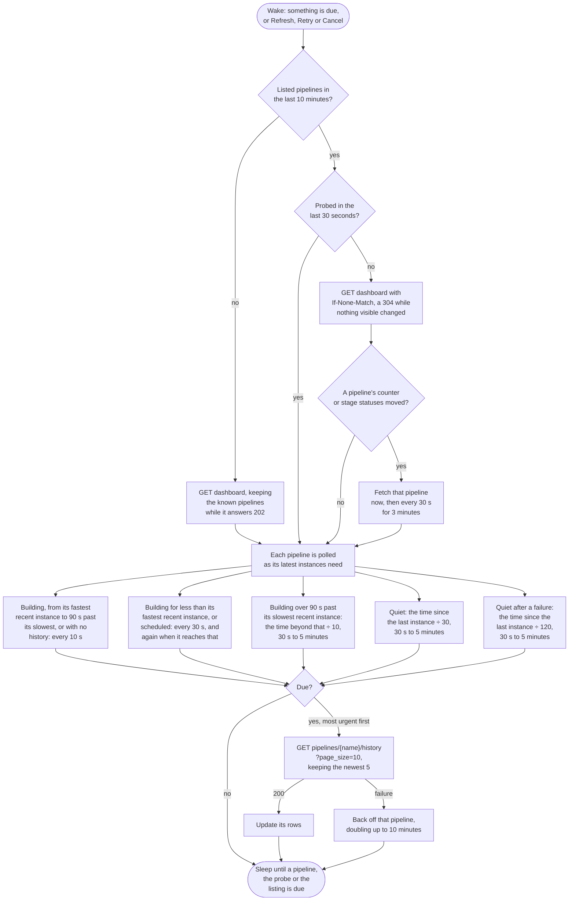

# GoCD

Watches every pipeline on the server.

## Credential

A [personal access token](https://api.gocd.org/current/#access-tokens), created at `https://<server>/go/access_tokens`.

## Rows

One per pipeline. The stages of an instance fold into one status: building while any stage builds, failed or cancelled when one is, passed when every scheduled stage passed. The branch comes from the git material.

## Actions

 * Retry re-runs the failed jobs of the failed stage, or schedules the pipeline when nothing failed
 * Cancel cancels the running stage
 * Copy log copies the consoles of the failed jobs of the failed stages

## Estimates

The countdown comes from the median of the pipeline's last ten successful instances.

## Polling

Each pipeline's history is fetched on its own schedule (see [Poll intervals](../options.md#poll-intervals)), and history carries no ETag, so each request returns a full response. Each poll interval the dashboard is read instead, with a conditional request that answers 304 while nothing visible changed. A pipeline whose instance counter or stage statuses moved is fetched at once. Progress inside a running job does not change the dashboard, and waits for the schedule.

## API notes

Researched 2026-09-14. No public GoCD server allows anonymous API reads, so these come from the API reference [docs] and the server source [source]. See [Provider APIs](api-comparison.md) for every provider side by side.

### Rate limits

None, and no rate limit headers [source].

### Conditional requests

 * The dashboard sends a quoted ETag, a digest of the user and each visible pipeline's name and last update. `If-None-Match` is compared without the quotes and without a `--gzip` suffix, and a match answers 304 [source].
 * Pipeline history sends no ETag [source].

### Change detection

The dashboard holds each pipeline's latest instance, plus any instance with a building or failing stage, with counters and stage statuses [source]. It follows the user's saved dashboard view. A configuration change bumps every pipeline's last update, so compare counters rather than timestamps. Progress within a job does not change the ETag.

### Batching

None for history, which is per pipeline. The dashboard has no branch, commit, author or finish time.

### Quirks

 * `history?page_size` must be between 10 and 100. Anything else is a 400: "The query parameter 'page_size', if specified must be a number between 10 and 100." Paging continues with `after` and `before` cursors [source].
 * The dashboard answers 202 until its cache has loaded [source].
 * `Accept: application/vnd.go.cd+json` without a version gets the latest version of each API, from 19.8 [docs], so pin versions where the shape matters.
 * A failing stage, where a job failed while others still run, reports the result Failed with a status other than Building [source].

### Sources

 * [Dashboard](https://api.gocd.org/current/#dashboard), [pipeline history](https://api.gocd.org/current/#get-pipeline-history) and [API versions](https://api.gocd.org/current/#api-versions)
 * Source: [ApiController.java](https://github.com/gocd/gocd/blob/master/api/api-base/src/main/java/com/thoughtworks/go/api/ApiController.java), [PipelineInstanceControllerV1.java](https://github.com/gocd/gocd/blob/master/api/api-pipeline-instance-v1/src/main/java/com/thoughtworks/go/apiv1/pipelineinstance/PipelineInstanceControllerV1.java) and the [dashboard API](https://github.com/gocd/gocd/tree/master/api/api-dashboard-v4)
