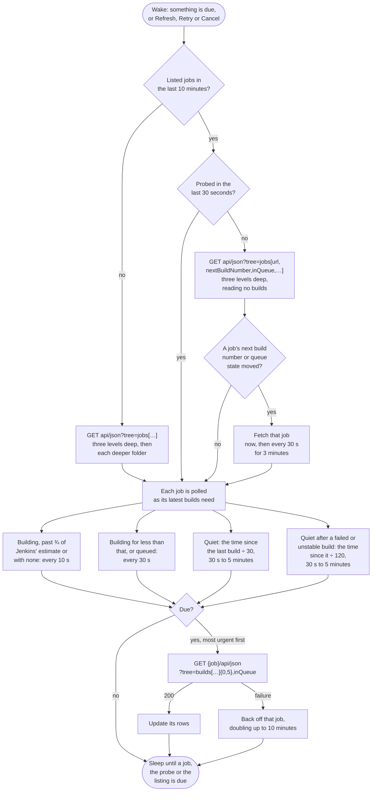

# Jenkins

Watches every job on the server, walking folders and multibranch projects. A branch of a multibranch project is a pipeline of its own, and a branch job named `PR-n` is shown as pull request n.

## Credential

An [API token](https://www.jenkins.io/doc/book/system-administration/authenticating-scripted-clients/), created at `https://<server>/me/security`, together with the Jenkins user name.

## Rows

One per job. A job with a queued build shows a queued row until it starts.

## Actions

 * Retry queues a new build of the job; Jenkins has no rerun. A parameterized job is built with its default parameters
 * Cancel stops a running build, or removes a queued one from the queue
 * Copy log copies the build's console

## Estimates

Jenkins reports an estimated duration for every build, from its own history, and that drives the countdown.

## Polling

Each job is fetched on its own schedule (see [Poll intervals](../options.md#poll-intervals)). Jenkins sends no ETags, and fetching a job reads its last builds from disk, so each poll interval one request reads the job tree instead, with each job's next build number and whether a build is queued. A job with a new or queued build is fetched at once; the rest wait for their schedule. Jobs nested deeper than three folders are not in that request, so they wait for the schedule too.

## API notes

Researched 2026-09-14. [live] means checked with anonymous requests against ci-builds.apache.org; [docs] and [source] name the evidence. See [Provider APIs](api-comparison.md) for every provider side by side.

### Rate limits

None, and no rate limit headers [live]. The cost is load on the controller: the remote API help recommends `tree` and treats `depth` as for exploring only [source].

### Conditional requests

None. `api/json` sends `X-Jenkins`, `X-Jenkins-Session`, `X-Content-Type-Options`, `X-Frame-Options` and `Cache-Control: private`, and answers `If-None-Match` and `If-Modified-Since` with a full 200 [source, live].

### Change detection

 * A tree shaped like discovery, `api/json?tree=jobs[url,_class,nextBuildNumber,inQueue,jobs[…]]`, reads no build records and costs about 240 bytes a job [live]. `nextBuildNumber` rises with every new build, even when old builds are discarded.
 * `queue/api/json?tree=items[id,inQueueSince,task[url]]` lists every queued item in one request [live].

### Batching

One tree with `builds[…]{0,5}` at every folder level returns everything in one request: 165 jobs came to 200 KB [live]. It costs the controller the sum of every job's query.

### Quirks

 * `builds[…]{0,5}` still walks up to 100 builds per job to count them, and can load build records from disk [source].
 * `estimatedDuration` on each build walks up to six earlier builds, so ask for it once per job through `lastBuild` [source].
 * Most `actions` entries in a build are empty: 5,239 of 5,398 [live].
 * A controller behind Tomcat rejects `{` and `}` left unencoded in the query with a 400; unencoded `[` and `]` are accepted [live].
 * Anonymous `api/json` on ci.jenkins.io returns a static `{}`.
 * Disabled and never built branch jobs are still listed.

### Sources

 * [Remote access API](https://www.jenkins.io/doc/book/using/remote-access-api/)
 * Source: [jenkinsci/jenkins](https://github.com/jenkinsci/jenkins) (`Api.java`, `Job.java`, `Run.java`, `RunList.java`, `Api/index.jelly`) and [jenkinsci/stapler](https://github.com/jenkinsci/stapler) (`ResponseImpl.java`, `Range.java`, `Property.java`)
