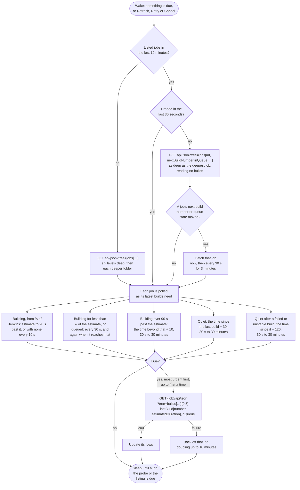

# Jenkins

Watches every job on the server, walking folders and multibranch projects. A branch of a multibranch project is a pipeline of its own, and a branch job named `PR-n` is shown as pull request n.


## Credential

An [API token](https://www.jenkins.io/doc/book/system-administration/authenticating-scripted-clients/), created at `https://<server>/me/security`, together with the Jenkins user name.


## Rows

One per job. A job with a queued build shows a queued row until it starts.


## Authors

Jenkins names nobody: a row is a job, and what a build records about who started it is a cause rather than a person. A build started with a `TriggeredBy` parameter names whoever it holds:

```groovy
build job: 'e2e', parameters: [string(name: 'TriggeredBy', value: 'Ada Lovelace')]
```

The value is a name, shown as it is written, or the id of one, which is named from what the other connections have seen. See [Authors](../authors.md).

The first twenty five parameters of each build are read, which comes back with the builds rather than costing a request of its own. A parameter that is not text, such as a flag, names nobody.


## Actions

 * Retry queues a new build of the job; Jenkins has no rerun. A parameterized job is built with its default parameters
 * Cancel stops a running build, or removes a queued one from the queue
 * Log copies the build's console


## Estimates

Jenkins estimates how long a job's latest build will take from its own history, and that drives the countdown.


## Polling

Each job is fetched on its own schedule (see [Poll intervals](../options.md#poll-intervals)), up to four at a time. Jenkins sends no ETags, and fetching a job reads its last builds from disk, so each poll interval one request reads the job tree instead, as deep as the deepest job, with each job's next build number and whether a build is queued. A job with a new or queued build is fetched at once; the rest wait for their schedule, which for a quiet job is up to thirty minutes.




## API notes

Researched 2026-09-14. [live] means checked with anonymous requests against ci-builds.apache.org; [docker] means checked against the secured Jenkins the [live tests](../live-tests.md) start; [docs] and [source] name the evidence. See [Provider APIs](api-comparison.md) for every provider side by side.


### Rate limits

None, and no rate limit headers [live]. The cost is load on the controller: the remote API help recommends `tree` and treats `depth` as for exploring only [source].


### Conditional requests

None. `api/json` sends `X-Jenkins`, `X-Jenkins-Session`, `X-Content-Type-Options`, `X-Frame-Options` and `Cache-Control: private`, and answers `If-None-Match` and `If-Modified-Since` with a full 200 [source, live].


### Change detection

 * A tree shaped like discovery, `api/json?tree=jobs[url,_class,nextBuildNumber,inQueue,jobs[…]]`, reads no build records and costs about 240 bytes a job [live]. `nextBuildNumber` rises with every new build, even when old builds are discarded.
 * `queue/api/json?tree=items[id,inQueueSince,task[url]]` lists every queued item in one request [live].


### Batching

One tree with `builds[…]{0,5}` at every folder level returns everything in one request: 165 jobs came to 200 KB [live]. It costs the controller the sum of every job's query.


### Quirks

 * `builds[…]{0,5}` still walks up to 100 builds per job to count them, and can load build records from disk [source].
 * `estimatedDuration` on each build walks up to six earlier builds, so ask for it once per job through `lastBuild` [source].
 * Most `actions` entries in a build are empty: 5,239 of 5,398 [live].
 * A controller behind Tomcat rejects `{` and `}` left unencoded in the query with a 400; unencoded `[` and `]` are accepted [live].
 * Anonymous `api/json` on ci.jenkins.io returns a static `{}`.
 * Disabled and never built branch jobs are still listed.
 * Stopping a build answers with a 302 to the page named in `Referer`, or to the build when there is none [source]. Older versions answer a queue cancel the same way.
   * HttpClient follows a redirect without the `Authorization` header. So on a server that anonymous users may not read, the build page answers 403, although the build stopped [docker].
   * Cancel therefore sends `whoAmI/api/json` as its `Referer`, since anyone may read that page [docker].


### Sources

 * [Remote access API](https://www.jenkins.io/doc/book/using/remote-access-api/)
 * Source: [jenkinsci/jenkins](https://github.com/jenkinsci/jenkins) (`Api.java`, `Job.java`, `Run.java`, `RunList.java`, `AbstractBuild.java`, `Executor.java`, `Api/index.jelly`) and [jenkinsci/stapler](https://github.com/jenkinsci/stapler) (`ResponseImpl.java`, `Range.java`, `Property.java`)
