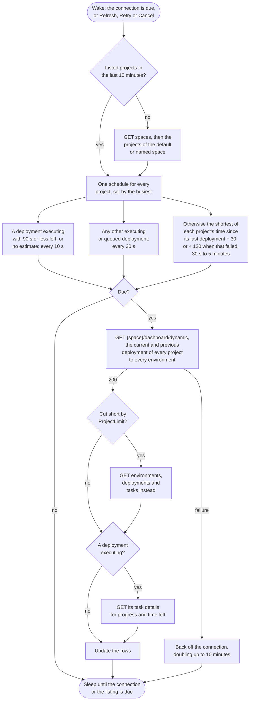

# Octopus Deploy

Watches the deployments of every project in one space: the default space, or the one the connection names.

## Credential

An [API key](https://octopus.com/docs/api/authentication/create-an-api-key), created under Profile, My API Keys.

## Rows

One per project, showing the latest deployment. The environment stands in for the branch and the release version for the run number.

## Actions

 * Retry re-runs the deployment task
 * Cancel cancels a queued or executing task
 * Copy log copies the deployment task's log

## Estimates

Octopus reports the progress and the estimated time remaining of an executing task, and that drives the bar and the countdown.

## Polling

One dashboard request returns the current and previous deployment of every project to every environment, instead of separate requests for environments, deployments and tasks, so the whole space is fetched on one schedule (see [Poll intervals](../options.md#poll-intervals)). An executing deployment costs one more request, for its progress. When a large server limits how many projects its dashboard returns, the separate requests are used instead.

## API notes

Researched 2026-09-14. [live] means checked with anonymous requests against the Octopus Cloud samples instance, which refuses API reads without a key; [docs] names the evidence. See [Provider APIs](api-comparison.md) for every provider side by side.

### Rate limits

None published, and no rate limit headers [live]. `Server-Timing: total;dur=…` shows how long the server took.

### Conditional requests

None seen: the API root sends `Cache-Control: private` and no ETag [live]. Endpoints behind a key are untested.

### Batching

 * `/api/{space}/dashboard/dynamic{?projects,environments,includePrevious}` returns the current and previous deployment for every project and environment in one request, each with `ProjectId`, `EnvironmentId`, `TenantId`, `ReleaseVersion`, `DeploymentId`, `TaskId`, `State` and times [docs]. It has no task description and no rerun or cancel links, and `ProjectLimit` and `IsFiltered` say when it was cut short.
 * `tasks?ids=a,b,c` fetches several tasks in one request [live].

### Change detection

 * `tasks?name=Deploy&take=1` returns the newest deployment task, and `TotalCounts` per state.
 * `/api/events?spaces=…&eventCategories=DeploymentQueued,DeploymentStarted,DeploymentSucceeded,DeploymentFailed&from=…` lists deployment events, and needs the EventView permission [docs].

### Quirks

Links are URI templates. A task's details link is `Details{?verbose,tail,ranges}` [docs], so expand or strip the template before requesting it. `verbose=false` and a small `tail` shrink the response, which otherwise carries the whole log tree.

### Sources

 * [REST API](https://octopus.com/docs/octopus-rest-api)
 * [Auditing](https://octopus.com/docs/security/users-and-teams/auditing)
 * Go client: [dashboard](https://pkg.go.dev/github.com/OctopusDeploy/go-octopusdeploy/v2/pkg/dashboard), [tasks](https://pkg.go.dev/github.com/OctopusDeploy/go-octopusdeploy/v2/pkg/tasks) and [events](https://pkg.go.dev/github.com/OctopusDeploy/go-octopusdeploy/v2/pkg/events)
 * [OctopusClients](https://github.com/OctopusDeploy/OctopusClients): `TaskResourceCollection.cs`, `TaskRepository.cs` and its canned task responses
 * [Dashboard performance on large installs](https://github.com/OctopusDeploy/Issues/issues/2850)
