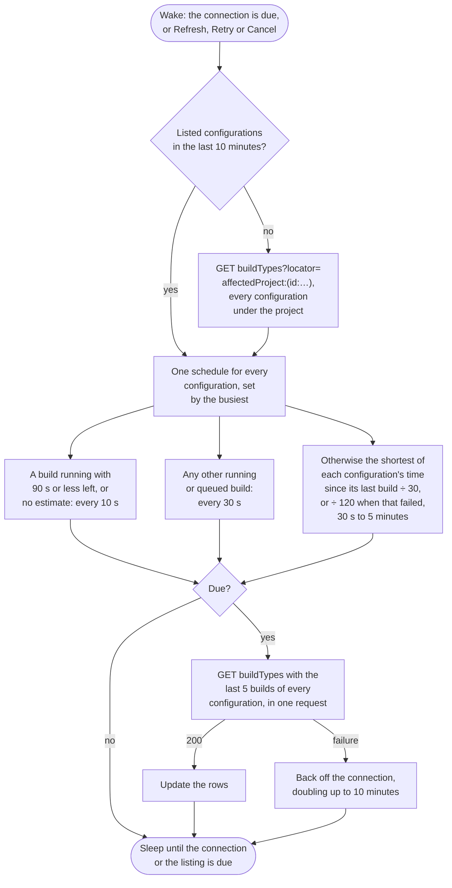

# TeamCity

Watches every build configuration on the server, or those under one project.


## Credential

An [access token](https://www.jetbrains.com/help/teamcity/configuring-your-user-profile.html#Managing+Access+Tokens), created under Profile, Access Tokens, with the same permissions as the user or limited to a project.


## Rows

One per build configuration. Branches named `pull/n` or `n/merge`, as the pull request features create them, are shown as pull request n.


## Actions

 * Retry queues a new build of the configuration on the same branch
 * Cancel cancels a queued or running build


## Estimates

TeamCity reports the percentage complete and the seconds left of a running build, and that drives the bar and the countdown.


## Polling

One request fetches the latest builds of every configuration, so a server with hundreds of configurations costs one call a poll, and a long build queue cannot push a quiet configuration out of the list.




## API notes

Researched 2026-09-14. [live] means checked with guest requests against teamcity.jetbrains.com; [docs] names the evidence. See [Provider APIs](api-comparison.md) for every provider side by side.


### Rate limits

None, and no rate limit headers [live]. JetBrains asks clients not to poll too often, to request only the fields they use, and not to raise `lookupLimit` above its default of 5,000 [docs].


### Conditional requests

None. Builds, build types and the build queue send no ETag, and `Cache-Control: no-store` [live].


### Batching

A nested locator returns up to N builds for every configuration in one request [live]:

```
buildTypes?locator=affectedProject:(id:X)&fields=buildType(id,builds($locator(branch:default:any,state:any,canceled:any,failedToStart:any,count:5),…))
```

A build with the usual fields is about 0.38 KB, so 500 configurations is about a megabyte.


### Change detection

 * `sinceBuild:(id:N)` returns only builds newer than N, including queued ones [live].
 * `sinceDate` counts only builds that have started, so it misses queued ones [docs].
 * Neither sees a state change of an older build.


### Quirks

With `state:any` the builds list puts queued builds first, so a long queue fills `count` and hides configurations: 74 of 100 builds were queued, and `count:1` returned a build queued six hours earlier [live].


### Sources

 * [REST API](https://www.jetbrains.com/help/teamcity/rest/teamcity-rest-api-documentation.html)
 * [Build locator](https://www.jetbrains.com/help/teamcity/rest/buildlocator.html)
 * [Get build details](https://www.jetbrains.com/help/teamcity/rest/get-build-details.html)
 * [Locators](https://www.jetbrains.com/help/teamcity/rest/locators.html)
 * [All projects and build types in one call](https://teamcity-support.jetbrains.com/hc/en-us/community/posts/360000484950-Return-all-projects-and-buildTypes-with-single-rest-api-call)
