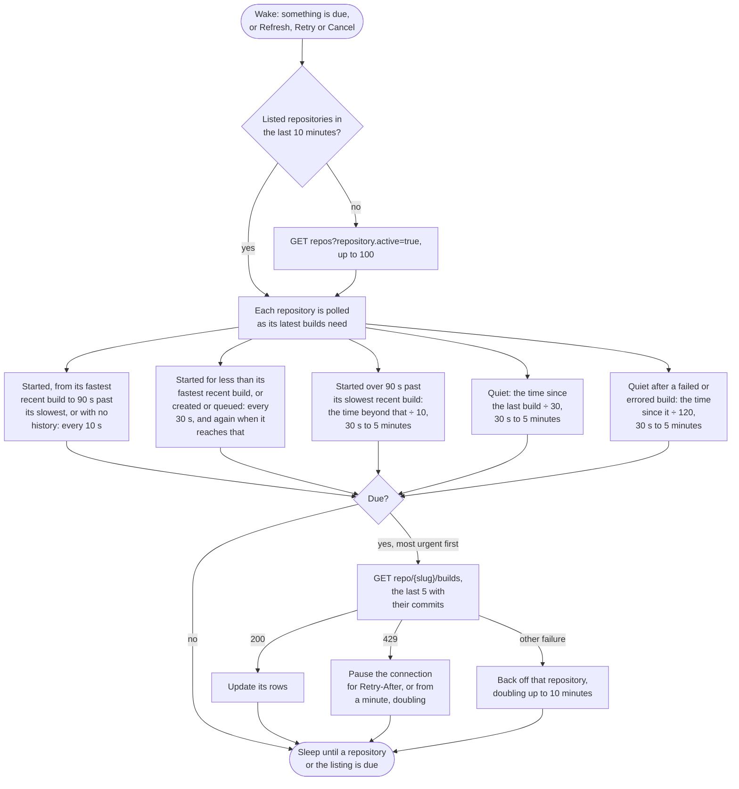

# Travis CI

Watches every active repository the token can see, on travis-ci.com or a Travis CI Enterprise server.

## Credential

An [API token](https://app.travis-ci.com/account/preferences), also shown by `travis token --com`.

## Rows

One per repository. Pull request builds link to the pull request on GitHub.

## Actions

 * Retry restarts the build
 * Cancel cancels a queued or running build
 * Copy log copies the logs of the failed and errored jobs, leaving out jobs allowed to fail

## Estimates

The countdown comes from the median of the repository's last ten successful builds.

## Polling

Each repository is fetched on its own schedule (see [Poll intervals](../options.md#poll-intervals)). Travis sends no ETags, so every request returns a full response, and no rate limit headers, so a limit is only seen when a request is refused; the pause then starts at a minute and doubles. Nothing cheap says which repositories have new builds, so a build on a quiet repository shows when its schedule comes round: within five minutes.

## API notes

Researched 2026-09-14. [live] means checked with anonymous requests against api.travis-ci.com; [docs] and [source] name the evidence. See [Provider APIs](api-comparison.md) for every provider side by side.

### Rate limits

2,000 requests a minute per token, and 500 a minute per IP address without one [source]. Successful responses carry no rate limit headers [live], and a 429 carries `Retry-After` only if the server enabled it, which it does not by default [source].

### Conditional requests

None, although CORS exposes an `Etag` header [live]. A build with its commit is about 3.6 KB.

### Change detection

 * `repos?repository.active=true&sort_by=current_build:desc&include=repository.last_started_build` puts the repositories with the newest builds first. The sort key is undocumented but works [live, source].
 * `current_build` is deprecated in favour of `last_started_build`, and neither includes builds created but not yet started [docs, live].
 * `/builds` returns only builds started by the token's own user [source].

### Batching

None beyond one build per repository.

### Quirks

 * A request without a login answers 403 `login_required` [live].
 * A build has no `created_at`, and its commit has no author unless requested with `include=build.commit` [live].

### Sources

 * [builds](https://developer.travis-ci.com/resource/builds), [repository](https://developer.travis-ci.com/resource/repository) and [repositories](https://developer.travis-ci.com/resource/repositories)
 * Source: [attack.rb](https://github.com/travis-ci/travis-api/blob/master/lib/travis/api/attack.rb), [builds.rb](https://github.com/travis-ci/travis-api/blob/master/lib/travis/api/v3/queries/builds.rb), [repositories.rb](https://github.com/travis-ci/travis-api/blob/master/lib/travis/api/v3/queries/repositories.rb) and [rack-attack](https://github.com/rack/rack-attack)
