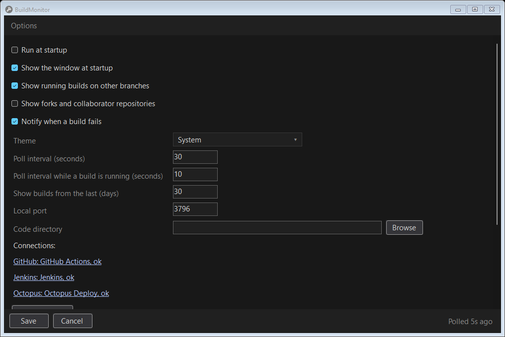
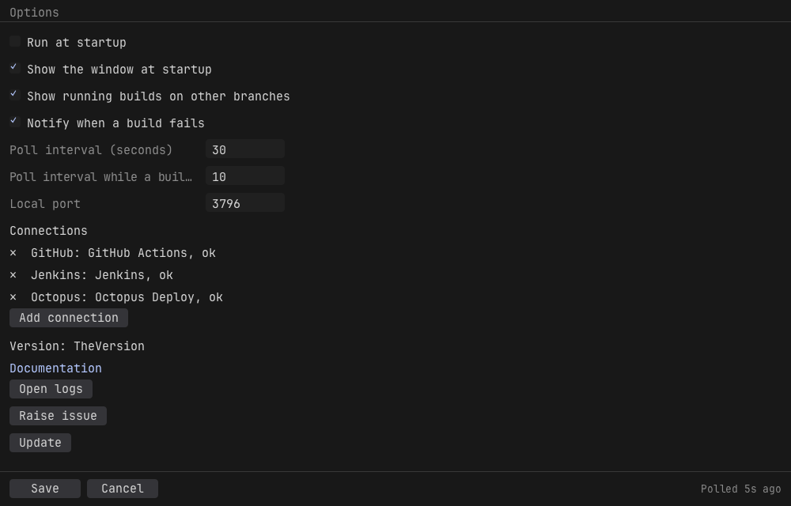
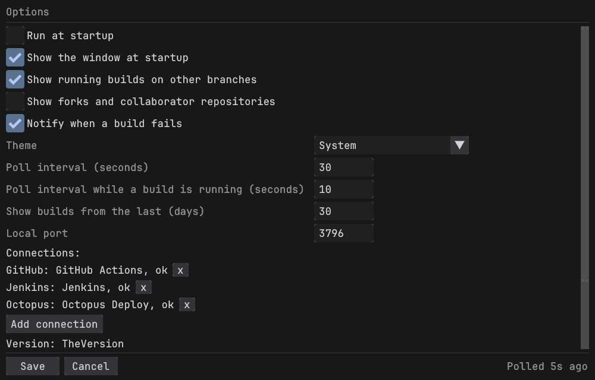
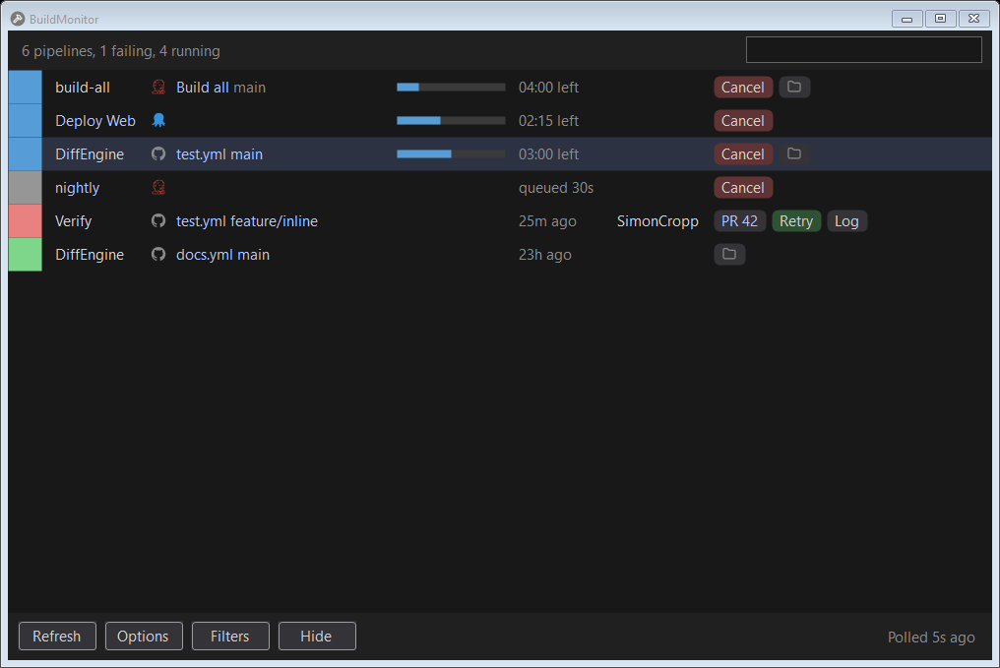
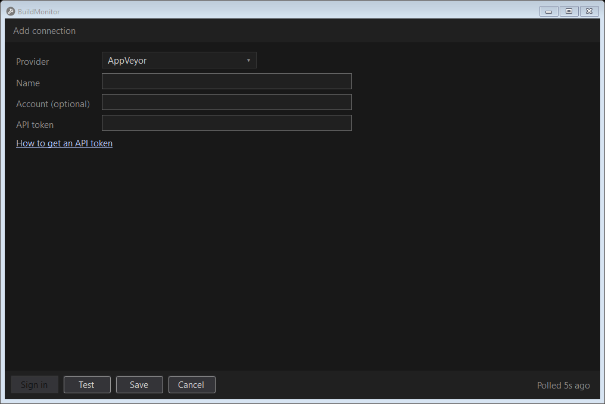

<!--
GENERATED FILE - DO NOT EDIT
This file was generated by [MarkdownSnippets](https://github.com/SimonCropp/MarkdownSnippets).
Source File: /docs/mdsource/options.source.md
To change this file edit the source file and then run MarkdownSnippets.
-->

# Options

Windows:

macOS:

Linux:

## Run at startup

Starts BuildMonitor at login. On Windows this is a value under the current user's Run registry key; on macOS a launch agent in `~/Library/LaunchAgents`; on Linux a desktop entry in `~/.config/autostart`. Each points at the `buildmonitor` command in `~/.dotnet/tools`, which stays put across updates.

## Show the window at startup

Whether the window opens when the tray starts, or only the icon appears.

## Show running builds on other branches

A pipeline's row is its latest run on any branch. With this on, every other branch that is queued or running right now gets a row too.

## Show forks and collaborator repositories

Off by default. GitHub then watches the repositories owned by the signed in account and by the organizations it belongs to, and leaves out forks and repositories where the account is only a collaborator. They are left out of discovery itself, so they cost no API calls. Turning it on discovers them on the next poll.

## Notify when a build fails

Pops a desktop notification when a poll finds a build that has failed since the previous poll. The first poll after starting is silent, so a red pipeline that has been red for a week is not announced every login. On Windows this is a balloon from the tray icon, on macOS a Notification Center banner, on Linux whatever `notify-send` reaches.

## Show builds from the last (days)

How far back a finished build is shown, 30 days unless changed, from 1 to 365. A pipeline whose last run is older has no row. Running and queued builds always show, however long ago they were queued, and a build that started before the limit shows once it finishes inside it.

GitLab CI takes the limit as part of the request (`updatedAfter`, or `updated_after` over REST), so a poll of a busy account returns less. The date sent is the start of a UTC day, so the request's URL stays the same all day and a cheap "not modified" answer keeps working.

Every other service's older builds are dropped as they arrive. GitHub Actions, Azure DevOps and TeamCity can filter by date, but only on when a build was created or queued, which would also leave out a build from before the limit that is still running or was re-run.

## Poll intervals

How often a repository, project or pipeline that built recently is polled, in seconds, and the shorter interval used while a running build is expected to finish.

Each repository, project or pipeline is scheduled on its own. One that has not built for a while is polled less often, at about a thirtieth of the time since its last build: an hour after a success it is checked every two minutes, and never less often than every five minutes. After a failure it slows four times more gradually, because a fix or a retry is likely soon. A retry or cancel from the tray checks that pipeline again at once, and Refresh checks everything.

A running build gets the shorter interval from the fastest of its pipeline's last ten successful runs until a minute and a half past the slowest, or near the end of the provider's own estimate where it gives one, and is checked the moment that stretch begins rather than at its next poll. A build still running after that slows down, at about a tenth of how far it has overrun, since its estimate was plainly wrong, until it is polled like a quiet one.

A repository that keeps failing backs off on its own without holding up the rest. When a provider's rate limit runs low, every interval stretches until the limit recovers. Every provider but GitHub Actions, GitLab CI and Octopus Deploy lets a quiet repository, project or pipeline wait up to thirty minutes, because a cheaper request in between notices a new build sooner.

## Local port

The loopback port the tray listens on. The `buildmonitor` command and the [MCP server](mcp.md) use it to reach the running tray, and it is what stops a second tray starting. Change it when something else already uses 3796. Takes effect after a restart, and can be overridden for one run with the `BuildMonitor_Port` environment variable.

## Code directory

Where the checkouts live. Browse picks it, or a path can be typed. Every git repository up to two folders below it, so both `code/DiffEngine` and `code/VerifyTests/DiffEngine`, gets a folder button on the rows of the pipelines it builds, which opens it in the file manager.

A checkout is matched to a pipeline by its `origin` remote first: `git@github.com:VerifyTests/DiffEngine.git` matches the repository GitHub Actions, Travis CI, Bitbucket Pipelines and AppVeyor name, and GitLab CI's namespaced path. Where that does not match, the folder's own name does, which is all there is to go on for Azure DevOps, TeamCity, Octopus Deploy, GoCd and Jenkins, none of which report a repository. A folder never wins a row from a checkout whose remote matched it.

Scanning stops at a checkout rather than going through it, so a submodule or a vendored dependency is not listed as a repository of its own. Nothing in the checkout is read but `.git/config`, and nothing is written.

The tray menu gains an Open code directory item while this is set, above Open logs, which opens the folder itself rather than any one checkout.

The list is kept current while BuildMonitor runs: a repository cloned into the directory gets its button without a restart. Only the folders that could hold a checkout are watched, not everything below them, so a directory full of repositories and their build output costs a bounded number of watches. An empty field watches nothing.

## Connections

The CI services being watched. Click one to edit it, or Add connection for a new one. See [Authentication](auth.md) for what each provider needs.

Test checks the credential without saving. Sign in starts a browser or device sign in where the provider supports one. Save stores the credential in the platform's secret store and starts polling; nothing secret is written to settings.json.

## Update

Runs `dotnet tool update` for BuildMonitor and restarts it. On Windows the update runs after the tray has exited, because a running executable cannot be replaced.

## Open logs

Opens the log directory, which sits beside the installed tool. See [Troubleshooting](troubleshooting.md).

## Raise issue

Opens a new GitHub issue with the version, operating system and log location filled in.
