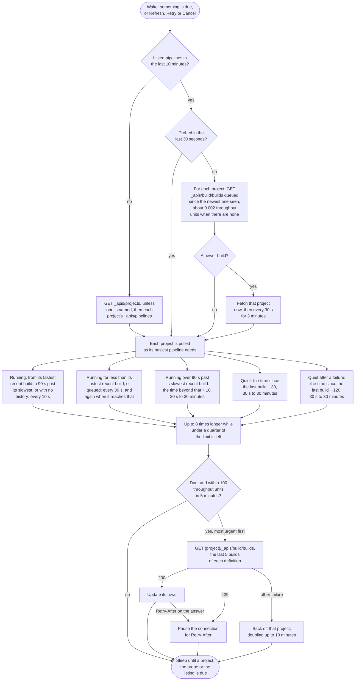

<!--
GENERATED FILE - DO NOT EDIT
This file was generated by [MarkdownSnippets](https://github.com/SimonCropp/MarkdownSnippets).
Source File: /docs/mdsource/providers/azure-devops.source.md
To change this file edit the source file and then run MarkdownSnippets.
-->

# Azure DevOps

Watches the pipelines of one organization, across every project or one named project.


## Credential

A [personal access token](https://learn.microsoft.com/en-us/azure/devops/organizations/accounts/use-personal-access-tokens-to-authenticate) with Build: Read & execute, sent as Basic authentication with an empty user name. Or sign in through Microsoft Entra ID, once an application is registered; see [Authentication](../auth.md). Personal Microsoft accounts cannot sign in that way: Microsoft's page turns the address away, so a personal account needs the token. A sign in's token is sent as `Authorization: Bearer`, as Microsoft's REST samples send one.

For Azure DevOps Server enter the server URL and the collection as the organization.


## Rows

One per pipeline definition. Pull request builds show the pull request number and link to it, on Azure Repos and on GitHub repositories, which are also the two kinds whose name links to the repository. The logo opens the pipeline definition.

A pull request build's source branch is the pull request's merge ref, so it is shown on the branch it came from instead, from the build's `system.pullRequest.sourceBranch` parameter or its `pr.sourceBranch` trigger info. Azure DevOps names neither a fork nor its owner, so a pull request from a fork is shown as `pull/n` rather than on a branch name that would read as one of the repository's own.


## Authors

A failed row names whoever the build was queued for, which for a build a pipeline queued on someone else's behalf is a service account rather than the person the failure concerns. Such a build can name that person itself, as an end to end suite run for whoever committed the code does, through a `TriggeredBy` build property holding their name.

Azure DevOps has no such property of its own. It is a name BuildMonitor reads and a pipeline chooses to write, so no build carries it by accident and one that does not is unaffected. [Update Build Properties](https://learn.microsoft.com/en-us/rest/api/azure/devops/build/properties/update-build-properties) writes it:

```
PATCH {project}/_apis/build/builds/{buildId}/properties?api-version=7.1
Content-Type: application/json-patch+json

[{"op": "add", "path": "/TriggeredBy", "value": "Ada Lovelace"}]
```

The value is a name, shown as it is written, or the id of one, which is named from what the other connections have seen (see [Authors](../authors.md)). An id nothing has named yet leaves the row naming whoever queued the build, so a name is the surer thing to write. The property's name is matched without case, and a value of nothing but spaces counts as none.

Which name a build settled on is in the log at Debug level (see [Troubleshooting](../troubleshooting.md)), because a row that fell back to the requester looks like any other.

Every build also leaves behind the name of the identity it was queued for, id and all, which is how a connection handed that id and no name — an Octopus release created by a pipeline — names it. See [Authors](../authors.md).


## Actions

 * Retry re-runs the build
 * Cancel cancels a queued or running build
 * Run next moves a build still in the queue to the front of it, which is what the run's own page
   calls Run next. Only on a queued row: a build that has started has left the queue. Besides the
   token's Build (Read & execute), the user needs the Manage build queue permission on the
   pipeline, which is a project security setting rather than a token scope
 * Log copies the logs of the failed tasks, or of a failed job when none of its tasks failed


## Estimates

The countdown comes from the median of the pipeline's last ten successful runs.


## Polling

Builds are fetched a project at a time, each on its own schedule (see [Poll intervals](../options.md#poll-intervals)). Azure DevOps sends no ETags, so every request is a full one, and it allows each user 200 throughput units in any five minutes. Requests are budgeted to half of that by the cost Azure DevOps reports on each response, and a pause it asks for is honoured before it starts delaying requests.

Each project asks for the last five builds of every definition, so a busy definition cannot push a quiet one out of the list. Each poll interval, each project is also asked only for builds queued since the newest one seen, which costs a small fraction of a fetch, so a new build on a quiet project shows within about thirty seconds. A retry started outside the tray reuses its build, and may wait for the schedule, which on a quiet project is up to thirty minutes.




## API notes

Researched 2026-09-14. [live] means checked with anonymous requests against the public dnceng-public organization; [docs] names the evidence. See [Provider APIs](api-comparison.md) for every provider side by side.


### Rate limits

 * Consumption is measured in throughput units (TSTU): 200 TSTU in any sliding five minutes per user, with each pipeline tracked separately. A typical user uses about 1 TSTU per five minutes [docs].
 * Past the limit, requests are first delayed by up to 30 seconds each, then blocked with a 429 and `TF400733` [docs].
 * `X-RateLimit-Cost` comes on every response, in TSTU to five decimal places [live]. `X-RateLimit-Limit`, `X-RateLimit-Remaining` and `X-RateLimit-Reset` (Unix seconds) come only as usage nears the limit, `X-RateLimit-Delay` once a request was delayed, and `X-RateLimit-Resource` is a label for people. `Retry-After` can arrive on a 200 [docs].
 * Only the Basic + Test Plans access level raises the limit [docs].

Measured costs [live]:

| Request | TSTU |
|---|---|
| builds, `$top=5` | 0.027 to 0.049 |
| builds, `$top=200` (1.16 MB) | 0.183 |
| builds, five `definitions` with `maxBuildsPerDefinition=2` | 0.052 |
| builds, `minTime` matching nothing | 0.0016 to 0.0024 |
| definitions, `includeLatestBuilds&$top=3` | 0.041 |
| pipelines, `$top=3` | 0.0056 |


### Conditional requests

None. Builds, definitions and pipelines lists send no ETag or Last-Modified, and `Cache-Control: no-cache, no-store, must-revalidate` [live]. Every request is a full, billed one.


### Change detection

 * `{project}/_apis/build/builds?minTime=…&queryOrder=queueTimeDescending` returns only builds queued after `minTime`. `minTime` applies to the queue, start or finish time according to `queryOrder` [docs]. An empty answer costs about 0.002 TSTU [live].
 * Rejected: a project's `lastUpdateTime` is metadata only, dated 2023 on a project building today [live]; git pushes need the `vso.code` scope and cover Azure Repos only; the Runs API has no top or time filter and returns up to 10,000 runs; service hooks need a public endpoint [docs].


### Batching

 * `maxBuildsPerDefinition=N` together with `definitions=` returns exactly N builds per definition, including definitions idle for years [live].
 * `$top` alone fills with the busiest definitions: 200 builds covered only 42 definitions [live].
 * An organization level `_apis/build/builds`, without a project in the path, exists in the .NET client but is unverified over REST; anonymous calls are redirected to sign in.


### Quirks

 * A personal access token that is wrong or expired is answered with a 302 to `…vssps.visualstudio.com/_signin` [live], or a 203 with an HTML page [docs]. A client that follows redirects sees HTML, not a 401.
 * The builds list needs a project in the path [docs].


### Queue order

`PATCH build/builds/{id}` with `{"queuePosition":1}`. Azure DevOps documents no verb for this: the run's own page has a Run next button, and `queuePosition` is one of the fields Update Build takes [docs]. `priority`, which is set when a build is queued, is the other candidate and is not what the button is described as changing.

Not checked live: it needs a real organization with a build waiting behind another, which the read tests' sandbox does not have. The live action round exercises the equivalent call for TeamCity only.


### Authentication

Checked 2026-09-16.

 * A personal access token goes as Basic authentication with an empty user name, as in `curl -u :{PAT}` [docs].
 * Microsoft's REST samples send a Microsoft Entra token as `Authorization: Bearer`. The personal access token page says an Entra token works anywhere a personal access token does, and one of its samples passes one to curl as Basic [docs].
 * A personal access token cannot read its own scopes: the PAT Lifecycle Management APIs, like the organization and profile APIs, take Microsoft Entra tokens only [docs].


### Sources

 * [Rate and usage limits](https://learn.microsoft.com/en-us/azure/devops/integrate/concepts/rate-limits)
 * [Use personal access tokens](https://learn.microsoft.com/en-us/azure/devops/organizations/accounts/use-personal-access-tokens-to-authenticate) and [REST API samples](https://learn.microsoft.com/en-us/azure/devops/integrate/get-started/rest/samples)
 * [Builds - List](https://learn.microsoft.com/en-us/rest/api/azure/devops/build/builds/list?view=azure-devops-rest-7.1)
 * [Builds - Update Build](https://learn.microsoft.com/en-us/rest/api/azure/devops/build/builds/update-build?view=azure-devops-rest-7.1), which lists `queuePosition` and `priority` among the fields it takes
 * [Properties - Update Build Properties](https://learn.microsoft.com/en-us/rest/api/azure/devops/build/properties/update-build-properties?view=azure-devops-rest-7.1)
 * [Definitions - List](https://learn.microsoft.com/en-us/rest/api/azure/devops/build/definitions/list?view=azure-devops-rest-7.1)
 * [Pushes - List](https://learn.microsoft.com/en-us/rest/api/azure/devops/git/pushes/list?view=azure-devops-rest-7.1)
 * [Runs - List](https://learn.microsoft.com/en-us/rest/api/azure/devops/pipelines/runs/list?view=azure-devops-rest-7.1)
 * [BuildHttpClientBase.GetBuildsAsync](https://learn.microsoft.com/en-us/dotnet/api/microsoft.teamfoundation.build.webapi.buildhttpclientbase.getbuildsasync?view=azure-devops-dotnet)
 * [HTTP 203 from the REST API](https://learn.microsoft.com/en-us/answers/questions/559772/azure-devops-rest-api-keep-getting-http-203)
