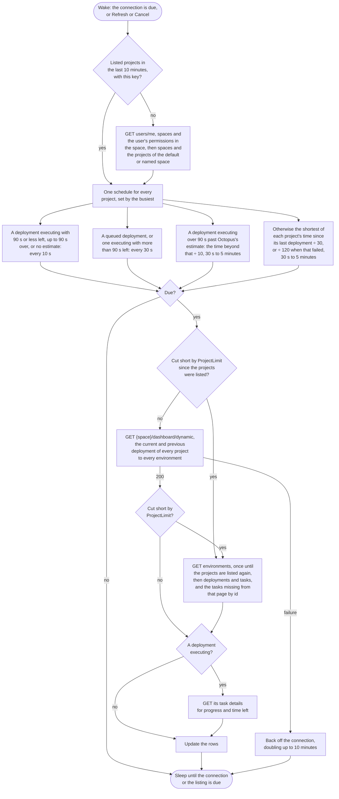

<!--
GENERATED FILE - DO NOT EDIT
This file was generated by [MarkdownSnippets](https://github.com/SimonCropp/MarkdownSnippets).
Source File: /docs/mdsource/providers/octopus.source.md
To change this file edit the source file and then run MarkdownSnippets.
-->

# Octopus Deploy

Watches the deployments of every project in one space: the default space, or the one the connection names.


## Server

The URL of the Octopus server, such as `https://octopus.example.com`. A server entered without a scheme is taken as https, so use `http://octopus.example.com` when the server is not on TLS. When Octopus runs under a virtual directory, include the path, such as `https://octopus.example.com/octopus`. Leave off `/api`, which is added for every request.


## Credential

An [API key](https://octopus.com/docs/api/authentication/create-an-api-key), created under Profile, My API Keys.


## Rows

One per project, showing the latest deployment. The project stands in for the repository, so each row is named after its project rather than grouped under the space, and being a project rather than a repository it is plain text rather than a link; the logo opens the project. The environment stands in for the branch and the release version for the run number.


## Authors

Octopus names nobody: a deployment a pipeline started is the service account's, whoever the release was really for. A release whose notes are JSON holding an `AzureDevOpsRequestedForId` names that person instead:

```json
{ "AzureDevOpsRequestedForId": "d1a80549-4d1f-642e-b5d5-9eca49ca5e24" }
```

The pipeline that creates the release writes them. Notes that are anything else, as a person's are, name nobody and are left alone.

Nothing in Octopus can turn that id into a name, because Azure DevOps minted it. It is named from what the other connections have seen, so a row names the person once a build of theirs has been fetched, and no one before that. See [Authors](../authors.md).

A release's notes are read once each, when a deployment of it first shows, and remembered for as long as the tray runs. A space whose releases carry no such notes pays one request per release seen and nothing after.


## Actions

 * Cancel cancels a queued or executing task
 * Log copies the deployment task's log

There is no retry: Octopus refuses to re-run a deployment task.

Cancel is offered only where the user has the TaskCancel permission for the deployment's project and environment. A user without it anywhere in the space shows as watch only in [Options](../options.md#connections).


## Estimates

Octopus reports the progress and the estimated time remaining of an executing task, and that drives the bar and the countdown.


## Polling

One dashboard request returns the current and previous deployment of every project to every environment, instead of separate requests for environments, deployments and tasks, so the whole space is fetched on one schedule (see [Poll intervals](../options.md#poll-intervals)). An executing deployment costs one more request, for its progress. When a large server limits how many projects its dashboard returns, the separate requests are used instead until the projects are next listed, reading the environments once in that time and fetching any task missing from the tasks page in one request.




## API notes

Researched 2026-09-14. [live] means checked with anonymous requests against the Octopus Cloud samples instance, which refuses API reads without a key; [docs] names the evidence. See [Provider APIs](api-comparison.md) for every provider side by side.


### Rate limits

None published, and no rate limit headers [live]. `Server-Timing: total;dur=…` shows how long the server took.


### Conditional requests

None seen: the API root sends `Cache-Control: private` and no ETag [live]. Endpoints behind a key are untested.


### Batching

 * `/api/{space}/dashboard/dynamic{?projects,environments,includePrevious}` returns the current and previous deployment for every project and environment in one request, each with `ProjectId`, `EnvironmentId`, `TenantId`, `ReleaseVersion`, `DeploymentId`, `TaskId`, `State` and times [docs]. It has no task description and no rerun or cancel links, and `ProjectLimit` and `IsFiltered` say when it was cut short.
 * `tasks?ids=a,b,c` fetches several tasks in one request [live].


### Change detection

 * `tasks?name=Deploy&take=1` returns the newest deployment task, and `TotalCounts` per state.
 * `/api/events?spaces=…&eventCategories=DeploymentQueued,DeploymentStarted,DeploymentSucceeded,DeploymentFailed&from=…` lists deployment events, and needs the EventView permission [docs].


### Quirks

Links are URI templates. A task's details link is `Details{?verbose,tail,ranges}` [docs], so expand or strip the template before requesting it. `verbose=false` and a small `tail` shrink the response, which otherwise carries the whole log tree.


### Permissions

Checked 2026-09-16. An API key has no scopes and acts as its user.

 * `users/{id}/permissions?spaces={space}&includeSystem=true` lists each space permission with every grant of it, each with its space and any restriction to projects, environments, tenants or project groups. `IsPermissionsComplete` says whether the requesting user could see all of it [OctopusClients].
 * Cancelling a task needs `TaskCancel`, which can be restricted to projects, environments and tenants [OctopusClients].
 * Whether a system administrator's grants in a space are listed is not documented.


### Sources

 * [REST API](https://octopus.com/docs/octopus-rest-api)
 * [Auditing](https://octopus.com/docs/security/users-and-teams/auditing)
 * Go client: [dashboard](https://pkg.go.dev/github.com/OctopusDeploy/go-octopusdeploy/v2/pkg/dashboard), [tasks](https://pkg.go.dev/github.com/OctopusDeploy/go-octopusdeploy/v2/pkg/tasks) and [events](https://pkg.go.dev/github.com/OctopusDeploy/go-octopusdeploy/v2/pkg/events)
 * [OctopusClients](https://github.com/OctopusDeploy/OctopusClients): `TaskResourceCollection.cs`, `TaskRepository.cs` and its canned task responses, and `UserPermissionSetResource.cs`, `UserPermissionRestriction.cs`, `UserPermissionsRepository.cs` and `Permission.cs`
 * [Dashboard performance on large installs](https://github.com/OctopusDeploy/Issues/issues/2850)
