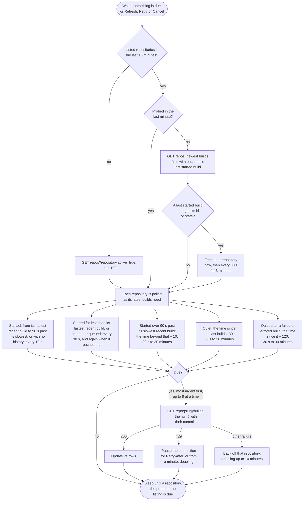

<!--
GENERATED FILE - DO NOT EDIT
This file was generated by [MarkdownSnippets](https://github.com/SimonCropp/MarkdownSnippets).
Source File: /docs/mdsource/providers/travis.source.md
To change this file edit the source file and then run MarkdownSnippets.
-->

# Travis CI

Watches every active repository the token can see, on travis-ci.com or a Travis CI Enterprise server.

## Credential

An [API token](https://app.travis-ci.com/account/preferences), also shown by `travis token --com`.

## Rows

One per repository, showing its latest build on the repository's default branch, which the repository listing names. Pull request builds link to the pull request on GitHub. Travis reports a pull request build's branch as the one it targets and names the branch it came from nowhere, so a pull request build is shown as `pull/n`.

## Actions

 * Retry restarts the build
 * Cancel cancels a queued or running build
 * Log copies the logs of the failed and errored jobs, leaving out jobs allowed to fail

Each build says whether the user may restart and cancel it, and a build that says no offers neither.

## Estimates

The countdown comes from the median of the repository's last ten successful builds.

## Polling

Each repository is fetched on its own schedule (see [Poll intervals](../options.md#poll-intervals)). Travis sends no ETags, so every request returns a full response, and no rate limit headers, so a limit is only seen when a request is refused; the pause then starts at a minute and doubles. Once a minute the repositories are listed with the newest builds first, each with its last started build, and a repository whose last started build changed is fetched at once rather than when its schedule comes round, which for a quiet repository is up to thirty minutes. A build created but not yet started shows once it starts.

A repository whose last five builds hold none on its default branch, as a burst of pull requests leaves them, is asked for its newest build there, by branch and by every event but a pull request's. A repository with none since the [history cutoff](../options.md#show-builds-from-the-last-days) is not asked again for an hour.

## API notes

Researched 2026-09-14. [live] means checked with anonymous requests against api.travis-ci.com; [docs] and [source] name the evidence. See [Provider APIs](api-comparison.md) for every provider side by side.

### Rate limits

2,000 requests a minute per token, and 500 a minute per IP address without one [source]. Successful responses carry no rate limit headers [live], and a 429 carries `Retry-After` only if the server enabled it, which it does not by default [source].

### Conditional requests

None, although CORS exposes an `Etag` header [live]. A build with its commit is about 3.6 KB.

### Change detection

 * `repos?repository.active=true&sort_by=current_build:desc&include=repository.last_started_build` puts the repositories with the newest builds first. The sort key is undocumented but works [live, source].
 * `current_build` is deprecated in favour of `last_started_build`, and neither includes builds created but not yet started [docs, live].
 * `/builds` returns only builds started by the token's own user [source].

### Batching

None beyond one build per repository.

### Quirks

 * A request without a login answers 403 `login_required` [live].
 * A build has no `created_at`, and its commit has no author unless requested with `include=build.commit` [live].

### Permissions

Checked 2026-09-16. A token has no scopes and acts as its user.

 * An object with permissions carries `@permissions` in any representation but the minimal one, and a listing renders its builds in the standard one [docs, source].
 * A build's are `read`, `cancel`, `restart` and `prioritize`. `cancel` and `restart` are the checks the cancel and restart endpoints make, from the user's rights on the repository [source].

### Sources

 * [builds](https://developer.travis-ci.com/resource/builds), [repository](https://developer.travis-ci.com/resource/repository), [repositories](https://developer.travis-ci.com/resource/repositories) and [the payload format](https://developer.travis-ci.com/format)
 * Source: [attack.rb](https://github.com/travis-ci/travis-api/blob/master/lib/travis/api/attack.rb), [builds.rb](https://github.com/travis-ci/travis-api/blob/master/lib/travis/api/v3/queries/builds.rb), [repositories.rb](https://github.com/travis-ci/travis-api/blob/master/lib/travis/api/v3/queries/repositories.rb), [model_renderer.rb](https://github.com/travis-ci/travis-api/blob/master/lib/travis/api/v3/model_renderer.rb), [permissions/build.rb](https://github.com/travis-ci/travis-api/blob/master/lib/travis/api/v3/permissions/build.rb) and [rack-attack](https://github.com/rack/rack-attack)
