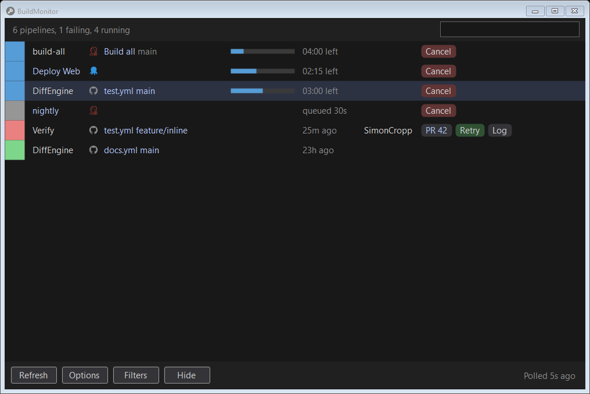

<!--
GENERATED FILE - DO NOT EDIT
This file was generated by [MarkdownSnippets](https://github.com/SimonCropp/MarkdownSnippets).
Source File: /docs/mdsource/tray.source.md
To change this file edit the source file and then run MarkdownSnippets.
-->

# The tray and the window

BuildMonitor runs in the system tray. The icon shows the overall state:

 * grey: nothing is being watched, or everything is idle
 * blue: a build is queued or running
 * green: every latest build succeeded
 * red: a latest build failed
 * amber: a connection needs attention, because its credential was refused or polling failed

Left click the icon to open the window. Right click it for the menu: every failing or running build with its own open, retry and cancel entries, then Open, Refresh, Options, Filters, Open logs, Raise issue, Update and Exit.

## The window

One row per pipeline, grouped by connection, showing the latest run on any branch. A branch with a queued or running build gets a row of its own beside the latest one, which is what makes a pull request build visible while it runs; turn that off in [Options](options.md).

Two or more green pipelines of one project, such as the passing workflows of one repository, share a single row; hover it to list them. A pipeline that fails or starts running leaves it for a row of its own. Double click the row, press Enter or right click it and choose Expand to see its pipelines one by one; right click one of them to collapse them again.

Rows sort what is happening now to the top of each group: running, then queued, then failed, then everything else by age.

Each row carries:

 * a status square and text; the squares of neighbouring rows touch, so a run of failures reads as one block
 * the pipeline, the repository and the branch
 * the run number
 * a progress bar and a countdown while the build runs, from the provider's own estimate where it gives one and otherwise from the median of the pipeline's last ten successful runs. A build that runs past its estimate shows how far over it is. Without any estimate the elapsed time is shown
 * links: Build opens the run, Branch opens the branch in the repository, PR opens the pull request
 * Retry, for a finished run; Cancel, for a queued or running one

Right click a row for the same actions plus copying the build URL and excluding the pipeline, which adds an exact match to the [filters](filters.md). Click a connection heading to fold its rows away.

Closing the window hides it; the tray keeps running. Exit is in the tray menu.

## Keyboard

 * Up and Down move the selection, PageUp, PageDown, Home and End scroll
 * Enter opens the selected build, or expands a shared green row, R retries it, Ctrl+C copies its URL
 * F5 refreshes
 * Escape hides the window, or cancels a form
 * Ctrl+Q exits

## Command line

The `buildmonitor` command starts the tray, or shows the window of the one already running. It also takes `show`, `hide`, `quit`, `refresh`, `status` (prints the connections and builds) and `mcp` (see [MCP](mcp.md)).
